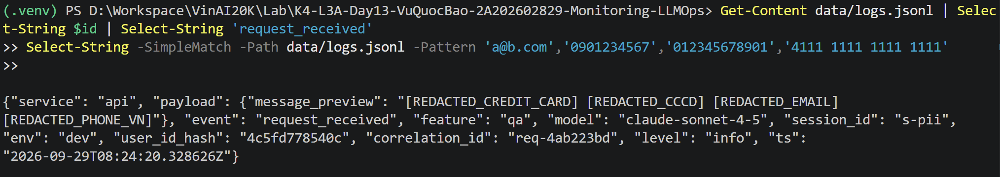
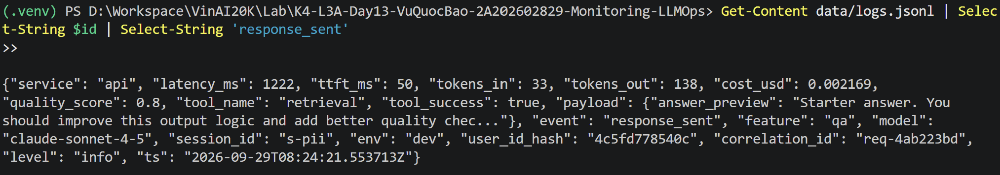
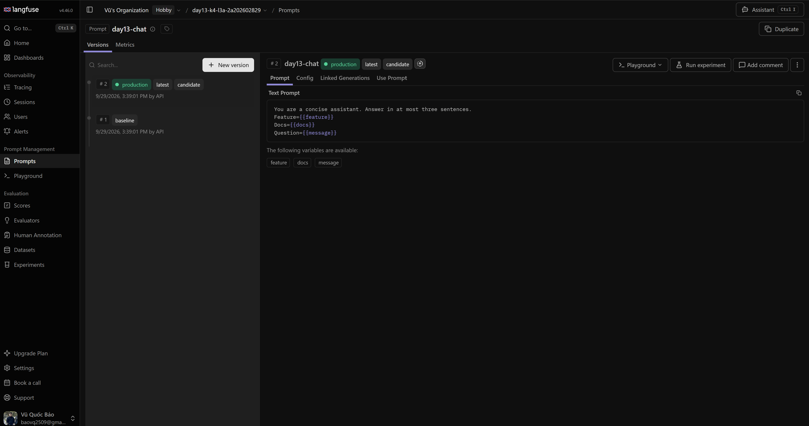
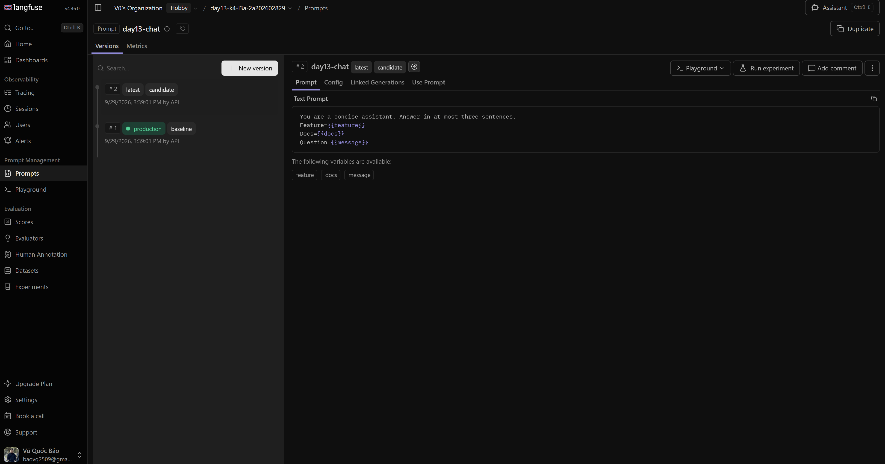
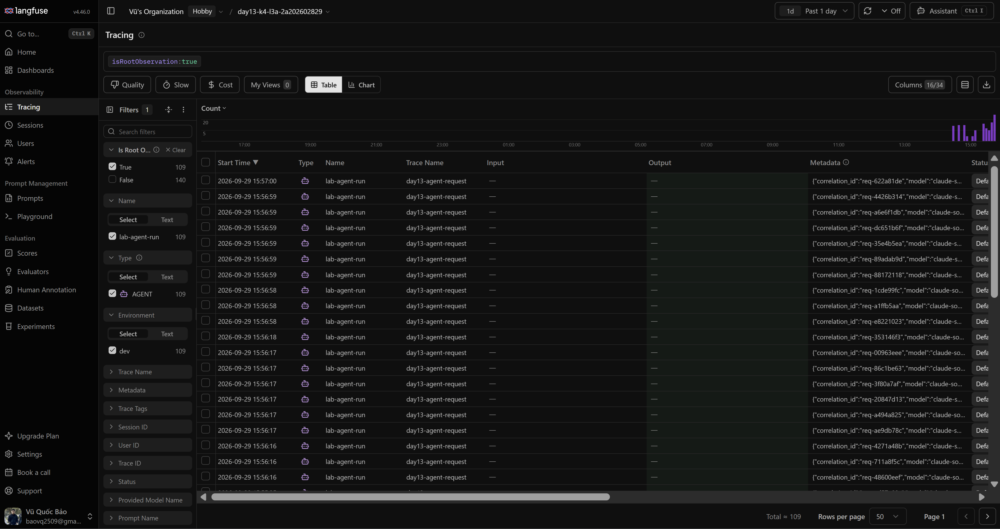
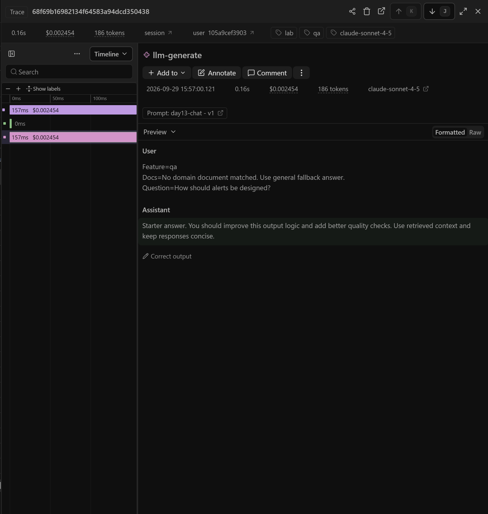
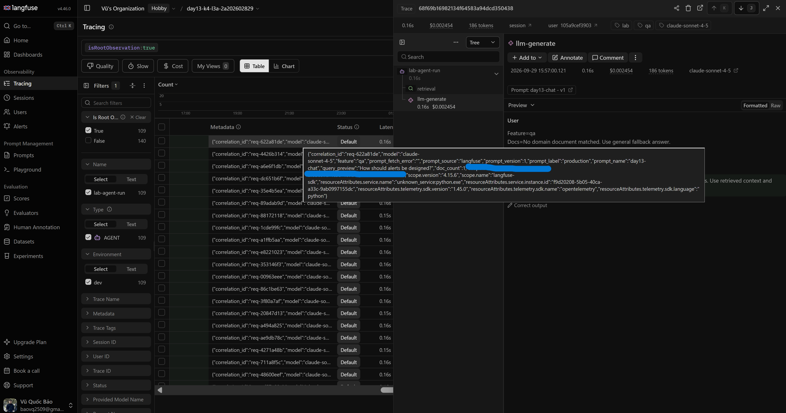
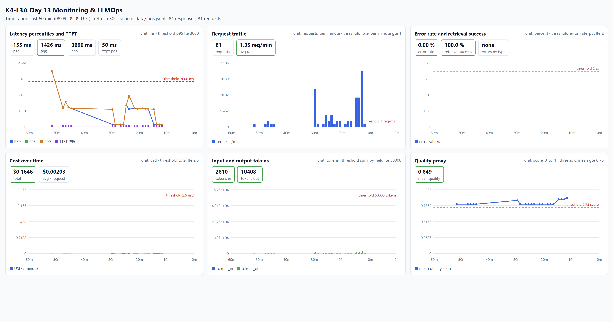

# Báo cáo cá nhân — K4-L3A Day 13 Monitoring & LLMOps

> Mỗi học viên hoàn thiện một file duy nhất này. Khi dẫn evidence, dùng đường dẫn tương đối, ví dụ `evidence/07-trace-waterfall.png`.

## 1. Thông tin học viên

- **Họ và tên:** Vũ Quốc Bảo
- **MSSV:** 2A202602829
- **Lớp:** K4-L3A
- **Repository URL:** https://github.com/byllkoy259/K4-L3A-Day13-VuQuocBao-2A202602829-Monitoring-LLMOps
- **Commit SHA cuối:**
- **Challenge ID:**
- **Tên project Langfuse cá nhân:** `day13-k4-l3a-2a202602829`

## 2. Evidence index

Điền đúng đường dẫn tới evidence thực tế. Có thể đổi tên hoặc dùng nhiều ảnh nếu cần.

| Evidence | Đường dẫn |
|---|---|
| Pytest cuối | `evidence/01-pytest.txt` |
| Log validator | `evidence/02-log-validator.txt` |
| Dashboard validator | `evidence/03-dashboard-validator.txt` |
| Structured log | `evidence/04-structured-log.png` |
| PII redaction | `evidence/05-pii-redaction.png` |
| Trace list | `evidence/06-trace-list.png` |
| Trace waterfall | `evidence/07-trace-waterfall.png` |
| Trace metadata | `evidence/08-trace-metadata.png` |
| Prompt versions | `evidence/09-prompt.png` |
| Prompt rollback | `evidence/10a-prompt-before.png` (production = v2), `evidence/10b-prompt-after.png` (production = v1 sau rollback) |
| Dashboard runtime | `evidence/11-dashboard.png` |
| Incident metric | `evidence/12-incident-metric.png` |
| Incident log | `evidence/13-incident-log.png` |
| Incident trace | `evidence/14-incident-trace.png` |

## 3. Kết quả kỹ thuật

| Nội dung | Baseline | Kết quả cuối | Nhận xét |
|---|---|---|---|
| `validate_logs.py` | 30/100 (21 record; 20 thiếu field bắt buộc; 20 thiếu enrichment; 0 correlation ID) | 100/100 (23 record; 0 thiếu field; 0 thiếu enrichment; 11 correlation ID; 0 PII leak) | Đúng như dự kiến fail do chưa làm TODO CP1; sau CP1 đạt 100/100 (yêu cầu ≥ 80) |
| `validate_dashboard.py` | HỢP LỆ: 6/6 panel | HỢP LỆ: 6/6 panel | Chỉ kiểm tra contract trong `config/dashboard.yaml`, chưa chứng minh dashboard runtime |
| `pytest` | 22 passed in 2.26s | 30 passed in 3.17s (thêm 8 test cho PII và correlation/logging) | Public tests đã pass ở baseline |
| Số traces hợp lệ | 0 (chỉ có root observation, chưa có child) | 15 trace có đủ root + retrieval + generation trong lần đầu chạy, cộng thêm 5 trace prompt version | Mỗi trace nối với log bằng `correlation_id` |
| Số PII leak | 0 (validator; xem giải thích ở CP0) | 0 (validator, sau khi gửi request chứa 4 loại PII giả) | Xem ghi chú CP0 bên dưới |
| Latency P95 / TTFT P95 | Chưa tính từ log (chỉ có 10 request mẫu: 1 request 1665.1 ms, 9 request còn lại 390.2–521.5 ms) | 1426 ms / 50 ms (93 response trong 60 phút) | Request đầu sau khi khởi động chậm nhất (P99 3690 ms), nghi do cold start |
| Retrieval success rate | Chưa đo | 100% (`tool_success`) | Trên workload thường, chưa bật incident |

### Baseline CP0

**Môi trường:** Windows, Python 3.11.9, virtualenv `.venv`, chạy API bằng `uvicorn`, workload bằng `python scripts/load_test.py` (10 request, feature `qa` và `summary`).

**Kết quả load test:** cả 10 request trả HTTP 200. Cột correlation ID in ra `MISSING` ở cả 10 request, vì `app/middleware.py` còn hard-code `correlation_id = "MISSING"`.

**Kết quả `validate_logs.py`:**

| Tiêu chí | Kết quả |
|---|---|
| Required fields (`ts`, `level`, ...) | FAILED (20/21 record thiếu) |
| Correlation ID propagation | FAILED (0 unique ID, cần ≥ 2) |
| Log enrichment (`user_id_hash`, ...) | FAILED (20/21 record thiếu) |
| PII scrubbing | PASSED (0 leak) |
| **Điểm ước tính** | **30/100** |

**Nguyên nhân (đối chiếu source):**
- Correlation ID: `middleware.py` chưa xóa contextvars, chưa đọc/sinh `x-request-id`, chưa bind ID, chưa trả header.
- Enrichment: `main.py` chưa `bind_contextvars(user_id_hash, session_id, feature, model, env)`.
- PII: `logging_config.py` chưa đăng ký `scrub_event`. Workload mẫu có chứa email, nhưng kết quả vẫn 0 leak vì log chỉ ghi `message_preview` do `summarize_text()` đã gọi `scrub_text` sẵn; `scrub_event` chưa được bật nên các field khác (ví dụ `detail` của lỗi) vẫn chưa được bảo vệ. Vì vậy 0 leak ở baseline chưa chứng minh pipeline scrub hoạt động, và cần kiểm tra lại bằng input có PII giả ở CP1.

**Kết quả `validate_dashboard.py` và `pytest`:** dashboard 6/6 panel hợp lệ; 22 test pass.

**Bước tiếp theo:** làm các TODO CP1, xóa hoặc đổi tên `data/logs.jsonl` cũ trước khi đo lại để log chưa scrub không bị tính.

**Evidence baseline:** lưu output terminal của bốn lệnh trên (dạng `.txt` hoặc ảnh) vào `submission/evidence/` với tên `00-baseline-*` để phân biệt với evidence cuối.

## 4. Logging và PII

- **Cách tạo/nhận và truyền correlation ID:** `CorrelationIdMiddleware` ([app/middleware.py](../app/middleware.py)) gọi `clear_contextvars()` ở đầu mỗi request để không rò context giữa các request. Sau đó nhận `x-request-id` từ header nếu khớp `[A-Za-z0-9_-]{1,64}`, nếu không thì sinh `req-<8-hex>` (từ `uuid4`). Giới hạn ký tự và độ dài để header không thể chèn dòng log giả hoặc làm phình log. ID được `bind_contextvars` nên mọi log trong request tự mang `correlation_id`, đồng thời lưu ở `request.state.correlation_id` để truyền vào agent/trace. Response trả lại header `x-request-id` và `x-response-time-ms`.
- **Các metadata được ghi vào structured log:** ngoài `ts`, `level`, `service`, `event`, `correlation_id`, handler `/chat` ([app/main.py](../app/main.py)) bind thêm `user_id_hash` (SHA-256 cắt 12 ký tự, không lưu `user_id` thô), `session_id`, `feature`, `model`, `env` trước log `request_received`. Log `response_sent` có thêm `latency_ms`, `ttft_ms`, `tokens_in`, `tokens_out`, `cost_usd`, `quality_score`, `tool_name`, `tool_success`.
- **Cách bảo đảm PII được scrub trước khi ghi:** `scrub_event` ([app/logging_config.py](../app/logging_config.py)) được đăng ký trong chuỗi processor **trước** `JsonlFileProcessor` và `JSONRenderer`, nên PII bị che trước khi serialize và trước khi ghi file. Processor duyệt đệ quy mọi giá trị chuỗi (kể cả `payload` lồng nhau, list, `detail` của lỗi), không chỉ `payload`. Các field do app tự sinh (`ts`, `level`, `correlation_id`, `user_id_hash`) được bỏ qua vì hash 12 ký tự có thể toàn chữ số và bị nhầm với CCCD. [app/pii.py](../app/pii.py) có rule cho email, điện thoại Việt Nam, CCCD 12 số, thẻ 16 số và thêm passport (`[A-Z]` + 7 số).
- **Cách kiểm chứng kết quả:**
  - `python scripts/validate_logs.py` đạt 100/100 trên log sạch (đã đổi tên log baseline trước khi đo lại): [evidence/02-log-validator.txt](evidence/02-log-validator.txt).
  - Gửi request có `x-request-id: req-4ab223bd` và message chứa thẻ, CCCD, email, điện thoại giả. Log `request_received` chỉ còn `[REDACTED_CREDIT_CARD] [REDACTED_CCCD] [REDACTED_EMAIL] [REDACTED_PHONE_VN]`, và `Select-String` các giá trị thô trong `data/logs.jsonl` không trả về dòng nào: 
  - Dòng `response_sent` cùng `correlation_id` `req-4ab223bd` có đủ metadata: 
  - Test tự động: [tests/test_logging_correlation.py](../tests/test_logging_correlation.py) (sinh và tái sử dụng ID, ID không an toàn bị thay, enrichment, không rò context giữa request, không còn PII thô trong file log) và [tests/test_pii.py](../tests/test_pii.py) (email, điện thoại, CCCD, thẻ, passport, văn bản sạch). Kết quả: [evidence/01-pytest.txt](evidence/01-pytest.txt), 30 passed.
- **Hạn chế đã biết:** `message_preview` bị cắt ở 80 ký tự sau khi scrub (`summarize_text`), nên với message dài thì các loại PII ở cuối không hiện trong preview (đã được che, chỉ là bị cắt). Chưa có rule cho địa chỉ.

## 5. Tracing và prompt versioning

- **Cách xác nhận traces do chính tôi tạo trong project cá nhân:** key trong `.env` là key của project Langfuse cá nhân `day13-k4-l3a-2A202602829`. Tôi tự chạy workload (`scripts/load_test.py` và các request `curl` có `x-request-id` cố định) rồi đọc lại trace từ chính project này qua Langfuse API (`observations.get_many`) để xác nhận cây observation và `correlation_id`. Ảnh trace list chụp từ project và thấy tên project, không mở trang API Keys. Ngoài các trace đầy đủ bên dưới, project còn vài trace cũ chỉ có root observation, sinh ra ở CP1 trước khi thêm child observation; tôi chỉ dùng trace có đủ cây span làm evidence.
- **Cấu trúc root/retrieval/generation observations** ([app/agent.py](../app/agent.py)):
  - `lab-agent-run` (root, type `agent`): metadata `feature`, `model`, `correlation_id`, `prompt_name`, `prompt_label`, `prompt_version`, `prompt_source`, `doc_count`; `capture_input/output=False` để không đẩy raw message lên Langfuse.
  - `retrieval` (child, type `retriever`): input `query_preview` đã scrub, output `doc_count`.
  - `llm-generate` (child, type `generation`): `model`, `usage_details` (input/output token), `cost_details` (input/output/total, đơn giá 3 và 15 USD/1M token như `_estimate_cost`), metadata `ttft_ms`; input và output đi qua `scrub_text` trước khi gửi. Generation nằm trong `propagate_attributes(prompt=managed_prompt)` nên được link tới đúng prompt name/version của Langfuse.
- **Cách nối trace với log:** cùng `correlation_id`. Log có trường `correlation_id`; trace root có `metadata.correlation_id` (ví dụ `req-prod0033`). Từ một dòng log lấy ID rồi tìm trace có metadata đó (hoặc ngược lại).
- **Prompt name:** `day13-chat` (text prompt, giữ ba biến `{{feature}}`, `{{docs}}`, `{{message}}`). Tạo bằng [scripts/manage_prompts.py](../scripts/manage_prompts.py) (`create`, `promote <version>`, `show`).
- **Version/label baseline:** v1 — label `baseline` và `production`, template gốc của lab.
- **Version/label candidate:** v2 — label `candidate`, thêm chỉ dẫn "You are a concise assistant. Answer in at most three sentences." (thay đổi nhỏ về độ dài/định dạng).
- **Trace ID của mỗi version** (cùng input `Explain why metrics traces and logs work together`; mỗi dòng là một lần khởi động server mới để tránh cache prompt 60 giây của app):

  | Bước | correlation_id | Trace ID | Prompt trên trace |
  |---|---|---|---|
  | label `baseline` | `req-basel003` | `38d4bf972af270374b7a813ea44ab9d2` | v1 |
  | label `candidate` | `req-cand0004` | `3a455a0be51b340d8dcdafe74bf2dfc4` | v2 |
  | `production` = v1 (trước khi promote) | `req-prod0031` | `9db5637f2b877e21afa15bb95a92ea00` | v1 |
  | `production` = v2 (sau promote) | `req-prod0032` | `72679b5c729cbcac496bffbe170c7cf8` | v2 |
  | `production` = v1 (sau rollback) | `req-prod0033` | `bba0f7d615fcd8cc1e579b0456402550` | v1 |

  Lưu ý: cùng các `correlation_id` này còn có một bộ trace thứ hai (chạy trùng do một lần chạy trước bị ngắt); bộ ở bảng trên là bộ mới hơn.
- **Cách promote và rollback `production`:** `python scripts/manage_prompts.py promote 2` gọi `update_prompt(name, version=2, new_labels=["production"])`, Langfuse tự chuyển label `production` từ v1 sang v2 (một label chỉ gắn với một version). Rollback là `promote 1`. `python scripts/manage_prompts.py show` in version đang gắn với `baseline`, `candidate`, `production`: trước là v1/v2/v1, sau promote là v1/v2/v2, sau rollback quay lại v1/v2/v1. Trace tương ứng ở bảng trên chứng minh version thực sự đổi theo label. Ảnh: Prompt versions: . Trước rollback (`production` = v2): . Sau rollback (`production` = v1): .
- **Ảnh trace:**   
- **Bài học kỹ thuật:** app cache prompt 60 giây (`cache_ttl_seconds=60`, stale-while-revalidate) nên sau khi đổi label, request kế tiếp trên cùng process có thể vẫn nhận version cũ. Khi lấy evidence tôi khởi động lại server sau mỗi lần đổi label; ngoài production nên hạ TTL hoặc chủ động làm mới cache khi rollback.

## 6. Dashboard, SLO và alerts

- **Dashboard và sáu panel:** dashboard được dựng bằng [scripts/build_dashboard.py](../scripts/build_dashboard.py) (HTML + SVG, không thêm dependency), đọc `data/logs.jsonl` làm nguồn chuẩn và đọc tên panel, đơn vị, threshold từ [config/dashboard.yaml](../config/dashboard.yaml). Time range 60 phút, tự refresh 30 giây, mỗi biểu đồ có đường threshold nét đứt đỏ. Sáu panel:
  1. Latency P50/P95/P99 và TTFT P95 (ms, threshold P95 ≤ 3000).
  2. Traffic (request/phút, ≥ 1).
  3. Error rate, breakdown theo `error_type` và retrieval success (%, error ≤ 2).
  4. Cost theo phút và tổng (USD, ≤ 2.5).
  5. Tokens vào/ra (≤ 50.000).
  6. Quality proxy (mean, ≥ 0.75).

  Kết quả trên workload thường (93 response trong 60 phút): P50 155 ms, P95 1426 ms, P99 3690 ms, TTFT P95 50 ms; error rate 0%, retrieval success 100%; tổng cost 0.188 USD (~0.002 USD/request); tokens vào 3.224, ra 11.891; quality trung bình 0.852. Ảnh: . P99 3690 ms là request đầu tiên sau khi khởi động server (cold start), không phải suy giảm thật.
- **SLO và lý do chọn:** SLO `fast_successful_requests` ([config/slo.yaml](../config/slo.yaml)): một request là "tốt" nếu có `response_sent` với `latency_ms ≤ 3000`, chia cho số `request_received`, target **99,0%** trong cửa sổ 28 ngày. Tôi hạ target từ 99,5% xuống 99,0% vì baseline của tôi có P50 ≈ 0,4 s, P95 ≈ 1,5 s nhưng có outlier cold start tới ~3,7 s, và ứng dụng chạy một tiến trình đơn lẻ; giữ 3000 ms để khớp threshold P95 của dashboard. Request lỗi (`request_failed`) không có `response_sent` nên cũng bị tính là xấu.
- **Cách tính error budget:** error budget = 100% − 99,0% = **1,0%** số request. Ví dụ với 10.000 request trong 28 ngày, tối đa 100 request được phép chậm hơn 3000 ms hoặc lỗi. Burn rate = (tỉ lệ request xấu trong cửa sổ) / 1,0%; burn rate > 1 nghĩa là đang tiêu budget nhanh hơn mức cho phép. Guardrail kèm theo: error rate ≤ 2%, cost ≤ 2,5 USD/ngày, quality ≥ 0,75, retrieval success ≥ 90%.
- **Ba alert và runbook tương ứng** ([config/alert_rules.yaml](../config/alert_rules.yaml), [docs/alerts.md](../docs/alerts.md)); cả ba là symptom-based, gửi Slack `#day13-alerts`, owner `vu-quoc-bao (on-call)`:

  | Alert | Severity | Điều kiện | Duration | Runbook |
  |---|---|---|---|---|
  | `high_latency_p95` | P2 | P95 `latency_ms` > 3000 | 5 phút | [Alert 1](../docs/alerts.md#alert-1) |
  | `high_error_rate` | P1 | request_failed / request_received > 2% | 5 phút | [Alert 2](../docs/alerts.md#alert-2) |
  | `cost_per_request_spike` | P2 | mean `cost_usd` > 0,005 USD (~2,5× baseline 0,002) | 10 phút | [Alert 3](../docs/alerts.md#alert-3) |

  Ba alert lần lượt tương ứng với các sự cố luyện tập `rag_slow`, `tool_fail` và `cost_spike`. Mỗi runbook có ba bước kiểm tra (dashboard → log `correlation_id` → trace) và mitigation.
- **Hạn chế:** Slack chưa được cấu hình thật, alert mới ở dạng định nghĩa trong YAML và runbook; chưa có bộ đánh giá alert tự động chạy trên log.

## 7. Điều tra challenge

- **Challenge ID:**
- **Khoảng thời gian điều tra:**
- **Triệu chứng từ metrics:**
- **Log line và correlation ID liên quan:**
- **Trace ID và span gây ảnh hưởng:**
- **Root cause:**
- **Fix action:**
- **Preventive measure:**

## 8. Giải thích và tự đánh giá

- **Một quyết định kỹ thuật quan trọng và lý do:**
- **Một lỗi/blocker đã gặp:**
- **Cách tìm nguyên nhân và xử lý:**
- **Cách hiểu luồng Metrics → Logs → Traces:**
- **Vai trò của prompt version, token/cost, SLO hoặc rollback trong vận hành LLM:**
- **Điều quan trọng nhất đã học:**
- **Hạn chế hoặc phần chưa hoàn thành, nếu có:**

## 9. Checklist trước khi nộp

- [ ] Kết quả và evidence thuộc commit SHA cuối.
- [ ] Tất cả ảnh/output mở được bằng đường dẫn tương đối.
- [ ] Incident evidence nối đúng metric → log → trace.
- [ ] Trace/prompt evidence thuộc project Langfuse cá nhân và ảnh không lộ key/secret.
- [ ] Repository chạy lại được theo README.
- [ ] Không có secret, API key, PII thô hoặc evidence của người khác/lớp khác.
- [ ] URL repo và commit SHA cuối đã được nộp trên LMS/Codelabs.
